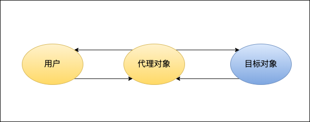

# Java进阶

## 反射

## 代理

Proxy(代理)是一种设计模式，通过代理对象间接访问被代理对象。代理主要是为了在不改变被代理对象的情况下，在被代理对象方法执行前、后扩展一些操作。



### 静态代理

静态代理是代理对象和被代理对象都实现了指定接口，代理对象对应的接口方法中调用被代理对象的接口方法并加以扩充。一个简单的使用场景如下。

```
//接口
public interface ILogin{
  void login();
}
//被代理对象
public class Login implements ILogin{
    @Override
    public void login() {
        System.out.println("login");
    }
}
//代理对象
public class ProxyLogin implements ILogin{

    private ILogin login;

    public ProxyLogin(ILogin login) {
        this.login = login;
    }

    @Override
    public void login() {
        System.out.println("before login");
        login.login();
        System.out.println("after login");
    }
}

public static void main(String[] args) {
    ProxyLogin proxyLogin = new ProxyLogin(new Login());
    proxyLogin.login();
}

```
### 总结

优点：可以在不修改源码的情况下对代理对象的功能进行扩充。

缺点：因为代理对象要实现和目标对象一样的接口，可能会导致代理类太多。并且接口变更代理类和目标类都要维护。

### 动态代理
为了解决静态代理缺点，就有了动态代理（JDK代理、接口代理）。动态代理有如下特点：

1、代理类是JDK的API动态在内存中生成的

2、代理类不需要实现接口

动态代理通过设置System.getProperties().put("sun.misc.ProxyGenerator.saveGeneratedFiles", "true")可以保存动态生成的代理类，具体使用方法如下。
```
 public <T> T createClass(final Class<T> service){
    T t = (T)Proxy.newProxyInstance(service.getClassLoader(), new Class<?>[]{service},
            new InvocationHandler() {
                //proxy:动态生成的代理对象($Proxy0.class) method:代理接口的方法  args:代理接口方法的参数
                @Override
                public Object invoke(Object proxy, Method method, Object[] args) throws Throwable {
                    //如果代理对象已经实现了该方法，则不需要代理直接正常调用
                    if (method.getDeclaringClass() == proxy.getClass()){
                         method.invoke(proxy,args);
                        System.out.println("正常调用");
                    }
                    System.out.println("代理前");
                    Thread.sleep(3);
                    System.out.println("代理后");
                    return "invoke success";
                }
            });
    return t;
}

```
### 总结

优点：

1、不需要实现接口，避免过多的代理类。

2、无论怎么修改接口，添加、减少接口方法，都不需要修改代理类。