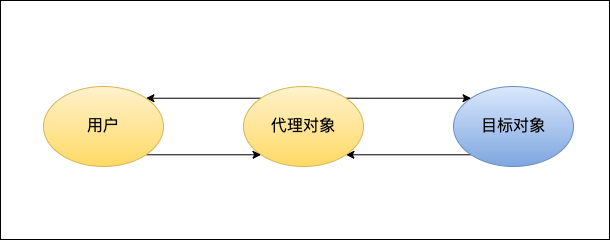

# Java进阶

## 一.反射

### 简介
反射是在运行过程中，对任意一个类，可以获取其所有方法、属性、父类、接口、注解等全部信息。对任意一个对象都可以调用它的任意一个方法。
这种动态获取信息及动态调用对象方法的功能称为反射机制。

### Class对象
- Class对象是反射基础，它包含了类的全部信息，使用来创建类的所有对象。
- Class对象是java.lang.Class<T>这个类生成的对象，T表示此Class建模的类的类型。
- Class类没有公共构造方法，Class对象是在加载类时由Java虚拟机及通过类加载器中的defineClass方法自动构造的。

### 获取Class
1. 通过对象的getClass()。
2. 通过Class类的静态方法，Class.forName("className")。
3. 使用类字面常量或TYPE字段(类.class , Integer.TYPE)。

### 类的信息
类名、类修饰符、包信息、父类、实现的接口、构造函数、方法、字段、注解

1.类名
```
Class cls = Point.class;
//完全限定类名（包括包名）
String name = cls.getName();
//同上
String name2 = cls.getCanonicalName();
//类名
String name3 = cls.getSimpleName();
```

2.修饰符
```
Class cls = Point.class;
int modifiers = cls.getModifiers();
Modifier.isAbstract(int modifiers)
Modifier.isFinal(int modifiers)
Modifier.isInterface(int modifiers)
Modifier.isNative(int modifiers)
Modifier.isPrivate(int modifiers)
Modifier.isProtected(int modifiers)
Modifier.isPublic(int modifiers)
Modifier.isStatic(int modifiers)
Modifier.isStrict(int modifiers)
Modifier.isSynchronized(int modifiers)
Modifier.isTransient(int modifiers)
Modifier.isVolatile(int modifiers)
```

3.包信息
```
Calss cls = Point.class;
//package中可以访问更多信息
Package pge = cls.getPackage();
String packageName = package.getName();
```

4.父类
```
Class cls = Point.class;
//返回父类class，由于编译时范型擦出，没有范型参数
Class sCls = cls.getSuperclass();
//返回父类的Type,包含范型信息
Type type = cls.getGenericSuperclass();
```

## 二.代理

Proxy(代理)是一种设计模式，通过代理对象间接访问被代理对象。代理主要是为了在不改变被代理对象的情况下，在被代理对象方法执行前、后扩展一些操作。



### 静态代理

静态代理是代理对象和被代理对象都实现了指定接口，代理对象对应的接口方法中调用被代理对象的接口方法并加以扩充。一个简单的使用场景如下。

```
//接口
public interface ILogin{
  void login();
}
//被代理对象
public class Login implements ILogin{
    @Override
    public void login() {
        System.out.println("login");
    }
}
//代理对象
public class ProxyLogin implements ILogin{

    private ILogin login;

    public ProxyLogin(ILogin login) {
        this.login = login;
    }

    @Override
    public void login() {
        System.out.println("before login");
        login.login();
        System.out.println("after login");
    }
}

public static void main(String[] args) {
    ProxyLogin proxyLogin = new ProxyLogin(new Login());
    proxyLogin.login();
}

```
### 总结

优点：可以在不修改源码的情况下对代理对象的功能进行扩充。

缺点：因为代理对象要实现和目标对象一样的接口，可能会导致代理类太多。并且接口变更代理类和目标类都要维护。

### 动态代理
为了解决静态代理缺点，就有了动态代理（JDK代理、接口代理）。动态代理有如下特点：

1、代理类是JDK的API动态在内存中生成的

2、代理类不需要实现接口

动态代理通过设置System.getProperties().put("sun.misc.ProxyGenerator.saveGeneratedFiles", "true")可以保存动态生成的代理类，具体使用方法如下。
```
 public <T> T createClass(final Class<T> service){
    T t = (T)Proxy.newProxyInstance(service.getClassLoader(), new Class<?>[]{service},
            new InvocationHandler() {
                //proxy:动态生成的代理对象($Proxy0.class) method:代理接口的方法  args:代理接口方法的参数
                @Override
                public Object invoke(Object proxy, Method method, Object[] args) throws Throwable {
                    //如果代理对象已经实现了该方法，则不需要代理直接正常调用
                    if (method.getDeclaringClass() == proxy.getClass()){
                         method.invoke(proxy,args);
                        System.out.println("正常调用");
                    }
                    System.out.println("代理前");
                    Thread.sleep(3);
                    System.out.println("代理后");
                    return "invoke success";
                }
            });
    return t;
}

```
### 总结

优点：

1、不需要实现接口，避免过多的代理类。

2、无论怎么修改接口，添加、减少接口方法，都不需要修改代理类。

## 三.泛型(Generic)

### 1.什么是泛型
 + 泛型是一种继承自Object的抽象类型。
 + 泛型可以定义给类、接口和函数。
 + 泛型在类、接口实例化和函数使用时指定具体的泛型类型。
 + 泛型指定具体类型时，只能是对象类型，不能代表基本类型数据。
 + Java泛型在编译时会被编译器擦出掉，自动转换为指定的泛型类型。
 + 由于上一条的原因，泛型不会影响运行速度。

### 2.没有泛型前

没有泛型前我们定义整型点的坐标类如下：

```
class IntegerPoint {

    Integer x;
    Integer y;

    public Integer getX() {
        return x;
    }

    public void setX(Integer x) {
        this.x = x;
    }

    public Integer getY() {
        return y;
    }

    public void setY(Integer y) {
        this.y = y;
    }
}
```
定义浮点型点如下：
```
class FloatPoint {
    Integer x;
    Integer y;

    public Integer getX() {
        return x;
    }

    public void setX(Integer x) {
        this.x = x;
    }

    public Integer getY() {
        return y;
    }

    public void setY(Integer y) {
        this.y = y;
    }
}
```
像上面的类，只是参数类型不同，类的结构是一样的，如果每一中类型都定义一个类，将会非常繁琐和难以维护。那么可以改进一下用对象作为坐标类型：
```
   class ObjectPoint {
        Object x;
        Object y;

        public Object getX() {
            return x;
        }

        public void setX(Object x) {
            this.x = x;
        }

        public Object getY() {
            return y;
        }

        public void setY(Object y) {
            this.y = y;
        }
    }
```
看起来Object好像有比较好的通用性，可以看下实际使用时情况
```
        ObjectPoint objectPoint = new ObjectPoint();
        objectPoint.setX(1);
        Integer x = (Integer) objectPoint.getX();
        //类型错误，但是编译器不会报错，代码复杂时会造成很大困扰
        String xS = (String) objectPoint.getX();
        System.out.println(x);
```
在使用的时候我们发现在获取参数时我们需要将获取到的参数转换为我们保存的类型。当在真正的程序开发中，我们存储和获取距离比较远的时候，我们也很难
记住或知道存储时的类型,即使类型错误编译器也不会报错，但运行时就会报类型转换错误。为了解决这类问题就出现了泛型。

### 3.泛型的定义及使用

泛型是一种继承自Object的类型，存在编译阶段的并且在编译阶段能够确定类型是否错误,在运行时会由Java编译器自动转换为确定的类型。泛型只能定义在类、接口和函数。

#### 泛型类定义</br>
1).类泛型定义：class 类名<T,V>{}</br>
2).接口泛型定义：Interface 接口<T，V>{}

#### 泛型函数定义</br>
public static <T> void 函数名(T a){}</br>
public <T> void 函数名(T a){}</br>
public <T> List<T> 函数名(T a){ return List<T> }</br>

```
    Point<Integer> pointI = new Point<>();
    Point<Float> pointF = new Point<>();
    pointI.setX(2);
    pointF.setX(1.0f);
    Integer xI = pointI.getX();
    Float xF = pointF.getX();
    //编译阶段，编译器就可以确定泛型类型，给予提示和报错
    String xS1 = pointI.getX();
    String xS2 = pointF.getX();
    System.out.println(xI);
    System.out.println(xF);
```
从上面的代码可以看出,泛型在获取参数时是可以确定类型，如果类型错误，编译器会报错。完美解决类型为Object时，不能确定类型的问题。

泛型默认是继承自Object的，拥有Object的所有函数及属性。这也是泛型不能是基础类型数据的原因。

#### 泛型优势
1.避免结构相同但参数类型不同的类过多定义。
2.不需要强制类型转换，编译时会泛型会自动转为具体类型，并检测类型是否正确。

#### 泛型使用
1).泛型类
```
//T 为类的泛型，
public class Point<T> {
    T x;
    T y;

    public T getX() {
        return x;
    }

    public void setX(T x) {
        this.x = x;
    }

    public T getY() {
        return y;
    }

    public void setY(T y) {
        this.y = y;
    }
}
//使用
Point<Integer> pointI = new Point<>();
Integer xI = pointI.getX();
```

2).泛型接口
```
//T 为接口范型
public interface Info<T> {

    public T getInfo();

    public void setInfo(T t);

}
//非范型类
public class InfoImp implements Info<String>{

    private String info;

    @Override
    public String getInfo() {
        return info;
    }

    @Override
    public void setInfo(String s) {
        this.info = s;
    }
}
//范型类
public class InfoImp2<T> implements Info<T>{

    private T t;

    @Override
    public T getInfo() {
        return t;
    }

    @Override
    public void setInfo(T t) {
        this.t = t;
    }
}
```
4).范型函数
```
public class MethodFans {
    //静态范型函数
    public static <T> void staticMethod(T a){
        System.out.println(a);
    }
    //普通函数
    public <T> void normalMethod(T a){
        System.out.println(a);
    }
}
//使用
MethodFans methodFans = new MethodFans();
//编译器会根据参数推测出范型类型，故可以省略
MethodFans.staticMethod(123);
MethodFans.<String>staticMethod("123");
//编译器会根据参数推测出范型类型，故可以省略
methodFans.normalMethod(123);
methodFans.<String>normalMethod("123");
```

## 四.其他

### Type
Type是所有类型的父接口，子接口有 ParameterizedType, TypeVariable, GenericArrayType, WildcardType, 实现类有Class。
```
public interface Type {
    default String getTypeName() {
        return this.toString();
    }
}
```
1.ParameterizedType(参数化类型)

类的范型类型

主要方法：
+ Type[] getActualTypeArguments(); 返回Type的范型类型数组
+ Type getRawType(); 返回类的全限定类名的Type
+ Type getOwnerType(); 当前类所属类的Type
