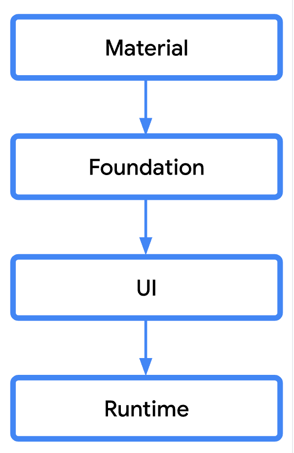
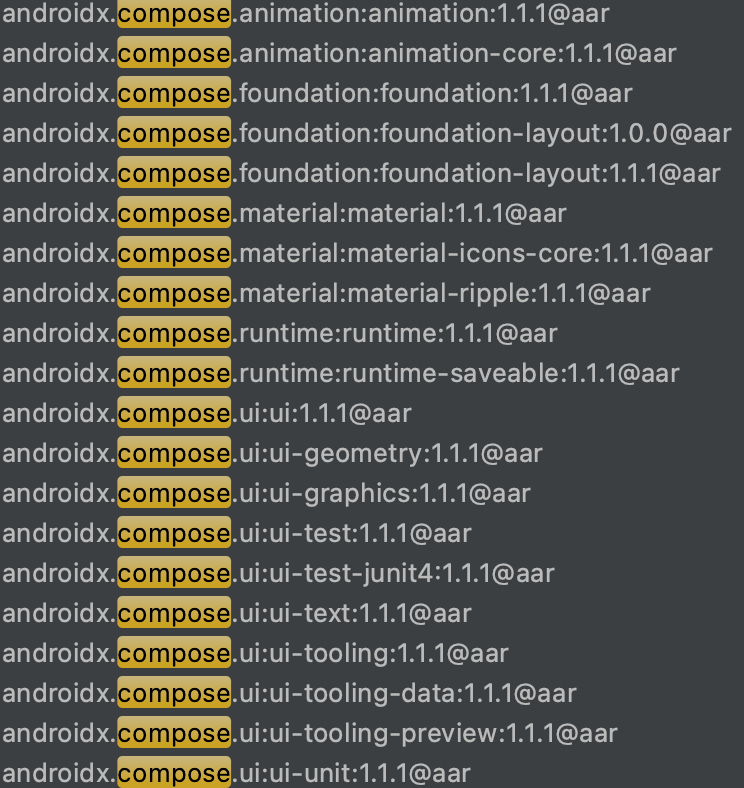

## 编程思想


### 以前：界面微件树

1. 问题需要手动管理界面状态显示及更新，多处更新时不好同步。
2. 当view不存在或被移除时，再设置数据容易异常。


### 现在：声明式界面模型

1. 可在不以命令方式改变前端视图的情况下呈现应用界面。
2. Compose 会智能地选择在任何给定时间需要重新绘制界面的哪些部分。
3. 不再关注界面状态、显示及同步等问题，大大简化了与构建和更新界面关联的工程设计。


### 需关注点

1. 可组合函数只负责根据状态数据显示界面和回调事件 —— **单向数据流模型**。
2. 数据的逻辑处理应该在后台的协程中执行或在可组合函数之外，然后将结果传递给**状态数据**。
3. 可组合函数可以按任何顺序执行。
4. 可组合函数可以并行执行。
5. 重组会跳过尽可能多的可组合函数和 lambda。
6. 重组是乐观的操作，可能会被取消。
7. 可组合函数可能会像动画的每一帧一样非常频繁地运行。
8. 每当状态更新时，都会发生重组。


## 组合和状态

**组合**：是可组合函数的**树结构**。

**状态**：是描述界面的**状态数据**，状态通常是使用 `mutableStateOf()` 创建可观察的 [`MutableState`](https://developer.android.google.cn/reference/kotlin/androidx/compose/runtime/MutableState)。后者是与 Compose 运行时集成的可观察类型。

```kotlin
interface MutableState<T> : State<T> {
    override var value: T
}

//remember 关键字，三种方式等效
val mutableState = remember { mutableStateOf(default) }
var value by remember { mutableStateOf(default) }
val (value, setValue) = remember { mutableStateOf(default) }
```

`value` 如有任何更改，系统会安排重组读取 `value` 的所有可组合函数。


### **关键术语** 

**可组合项**：可组合函数-界面。

**状态**：描述界面的可观察数据-状态数据。

**组合**：可组合项构建的界面描述，是可组合项的树结构。

**初始组合**：通过首次运行可组合项创建组合。

**重组**：在数据发生变化时重新运行可组合项以更新组合。

**状态容器**：用于管理可组合项的逻辑和状态。

**调用点**：代码调用位置。

**附带效应**：是指在可组合函数范围之外发生的应用状态变化。

**效应**：是一种可组合函数，该函数不会发出界面，并且在组合完成后产生附带效应。

**副作用**：如修改属性或全局变量，从而使影响范围超出可组合函数范围(附带效应)。

**Effect API**：效应API是一种可组合函数，该函数不会发出界面，并且在组合完成后产生附带效应。


**组合只能通过初始组合生成且只能通过重组进行更新。重组是修改组合的唯一方式。**如果输入不表，则跳过重组。


### 可组合项

1. 声明范式转变：从对象树 -> 组合函数。
2. 动态内容： 智能选择需要重绘的可组合函数。
3. 重组：重组会跳过尽可能多的内容、重组是乐观操作。


### 可组合项的生命周期

1. **要点**：可组合项的生命周期通过以下事件定义：**进入组合，执行 0 次或多次重组，然后退出组合。**
2. **说明**：重组通常由对 State<T> 对象的更改触发。Compose 会跟踪这些操作，并运行组合中读取该特定 State<T> 的所有可组合项以及这些操作调用的无法跳过的所有可组合项。
3. **实例**：由调用点标识。
4. **列表**：key标记唯一id，可重用item可组合项实例。默认支持(LazyColumn)。
5. **跳过重组**：组合中已有可组合项，所有输入都处于**稳定状态**且没有变化时，跳过重组。(输入相等，则跳过重组)。
   - 基本类型：`Boolean`、`Int`、`Long`、`Float`、`Char` 等。
   - 字符串。
   - 所有函数类型（lambda）。
6. **稳定状态**：两个相同实例。
   - 两个相同实例`equals` 的结果将始终相同。
   - 公共属性变化，组合可以收到通知。
   - 所有公共属性也都是稳定状态。
   - 接口通常被视为不稳定类型，并且具有可变公共属性的类型（实现可能不可变）的类型也被视为不稳定类型。
   - 使用 [`@Stable`](https://developer.android.google.cn/reference/kotlin/androidx/compose/runtime/Stable) 注解对其进行标记为稳定类型。
   - @Immutable，标记为不可变类型，用于对可组合项进行优化。

### 副作用（附带效应）

**LaunchedEffect**：在某个可组合项的作用域内运行挂起函数。

**rememberCoroutineScope**：获取组合感知作用域，以便在可组合项外启动协程。

**rememberUpdatedState**：在效应中引用某个值，该效应在值改变时不应重启。

**DisposableEffect**：需要清理的效应。

**SideEffect**：将 Compose 状态发布为非 Compose 代码。

**produceState**：将非 Compose 状态转换为 Compose 状态。

**derivedStateOf**：将一个或多个状态对象转换为其他状态。

**snapshotFlow**：将 Compose 的 State 转换为 Flow。


## 生命周期


## 修饰符

#### 作用

- 更改可组合项的大小、布局、行为和外观
- 添加信息，如无障碍标签
- 处理用户输入
- 添加高级互动，如使元素可点击、可滚动、可拖动或可缩放

#### 特性

- 修饰符只在自己作用域内可用
- 修饰符执行顺序敏感

#### 常用修饰符

```kotlin
Modifier.size(width=40.dp,height=100.dp)
Modifier.requredSize(150.dp)//不受父布局约束影响
Modifier.fillMaxHeight()
Modifier.fillMaxWidth()
Modifier.fillMaxSize()
Modifier.padding(10.dp)
Modifier.offset(x=4.dp)
Modifier.clickble(onclick = onClick)
Modifier.matchParentSize()//只在Box布局中可用，子布局与父项 Box 尺寸相同而不影响 Box 的尺寸
Modifier.weight(2f)//权重
```


## 阶段

### 帧的阶段

Compose主要阶段为： 组合、布局（测量和放置）、绘制

### 阶段读取

状态通常是使用 `mutableStateOf()` 创建，


## CompositionLocal

### 关键术语

**组合**：是可组合函数的调用图的记录。

**界面树**或**界面层次结构**：是由组合进程构造、更新和维护的 `LayoutNode` 树。

将数据的作用域限定在局部。


## 布局

#### 布局标准元素

https://developer.android.google.cn/reference/kotlin/androidx/compose/foundation/layout/package-summary

```kotlin
Column{}
Row(}
Box{}
BoxWithConstraints{}
```

#### 布局模型

深度遍历：父节点会在其子节点之前进行测量，但会在其子节点的尺寸和放置位置确定之后再对自身进行调整。

固有特性测量：可以自定义多次测量

#### 基于槽位的布局

Compose 提供了大量基于 [Material Design](https://material.io/design/) 的可组合项，我们只需填入对应的组合元素即可自动布局到相应位置。


## 架构分层







## 常用可组合函数

#### 示例


```kotlin
Column()
Row()
Box()
Text()
Image()
Icon()
OutlinedTextField()
Button()
TextButton()
HorizontalPager()
```


## 主题

## 动画

### 高级别动画

```kotlin
//出现消失动画,可以通过指定 EnterTransition 和 ExitTransition 来自定义这种过渡效果。
AnimatedVisibility(Boolean,EnterTransition,ExitTransition)
//在内容根据目标状态发生变化时，为内容添加动画效果
AnimatedContent()
//修饰符可为大小变化添加动画效果。
animateContentSize
//可使用淡入淡出动画在两个布局之间添加动画效果。
Crossfade
```


### 低级别动画

`animate*AsState` 函数是 Compose 中最简单的动画 API，用于为单个值添加动画效果。您只需提供结束值（或目标值），该 API 就会从当前值开始向指定值播放动画。


Compose 为 `Float`、`Color`、`Dp`、`Size`、`Offset`、`Rect`、`Int`、`IntOffset` 和 `IntSize` 提供开箱即用的 `animate*AsState` 函数。通过为接受通用类型的 `animateValueAsState` 提供 `TwoWayConverter`，您可以轻松添加对其他数据类型的支持。


## 资料


### 支持库

https://github.com/google/accompanist